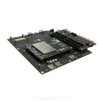

# Qualcomm® CM2290 Open Kits WIFICamera-demo Developer documentation

## Introduce

This project relies on CM2290 development kit, and makes use of the diversified and powerful connection capability of development kit. AP WIFI was enabled through HostAPD and UDHCPD tools, and RTSP streaming function was completed through GStreamer and GST-RTSP-Server, enabling us to remotely view the videos captured by onboard cameras on mobile phones after connecting to WIFI.

At present, the development of the Internet of Things is gaining momentum, and there are more and more scenarios that can be applied. I want to remotely check the situation in my home, so I developed this simple project of wificamera.

The project was built in x86 host with across complier tool and has been tested in Qualcomm® CM2290 Open Kits.

Qualcomm® CM2290 SoC Open Kits



## Materials and Tools used for the project

1. Hardware materials

Except for the Open Kits,The following hardware materials are also needed:

* Type-C usb line

using the usb line to develop on Qualcomm® CM2290 SoC Open Kits.


* Charger

Direct power supply for Qualcomm® CM2290 SoC Open Kits.


## Environment configuration

This section mainly describes the source and configuration of some open source projects or third-party tools needed in the development process.

### Gstreamer
[Gstreamer](https://www.yoctoproject.org) <br>
GStreamer is a library for constructing graphs of media-handling components. The applications it supports range from simple Ogg/Vorbis playback, audio/video streaming to complex audio (mixing) and video (non-linear editing) processing.

### gst-rtap-server
[gst-rtap-server](https://github.com/GStreamer/gst-rtsp-server)<br>
gst-rtsp-server is a library on top of GStreamer for building an RTSP server.

The server relies heavily on the RTSP infrastructure of GStreamer. This includesall of the media acquisition, decoding, encoding, payloading and UDP/TCP streaming. We use the rtpbin element for all the session management. Most of the RTSP message parsing and construction in the server is done using the RTSP library that comes with gst-plugins-base. 

## Compile

The compilation of the whole project is based on the yocto compilation tool, so you need to write some .bb and .conf files according to the specification. The gst-pipe_0.1.bb file is provided in the project.

Please refer to [the official Manual of Yocto](https://www.yoctoproject.org) for how to add layers,write layer.conf. Then,excute the command as follows:

```
bitbake gst-pipe
or
bitbake -b gst-pipe_0.1.bb
```

You will get some executable bin file.Move to the bin folder of the project.

## Configure and Usage
Start the CM290 and connection CM290 to host by Type-c usb.
### 1. Configure
All configuration and start up is done through wifi_camera.sh scripts.
```
Note: Including starting ap wifi, rtsp server, rtsp push stream
```

### 2. Usage

This project only provides a simple command line interface.

**Run wifi_camera.sh on host**
```
$ ./wifi_camera.sh
```

**Mobile phone connected to wifi**
wifi name and password can be found in udhcpd.conf.

**third-party resources**
[Download EasyPlayer APP](http://app.tsingsee.com/EasyRTSPlayer) 
add rtsp url(udp protocol): rtsp://192.168.0.1:8900/live